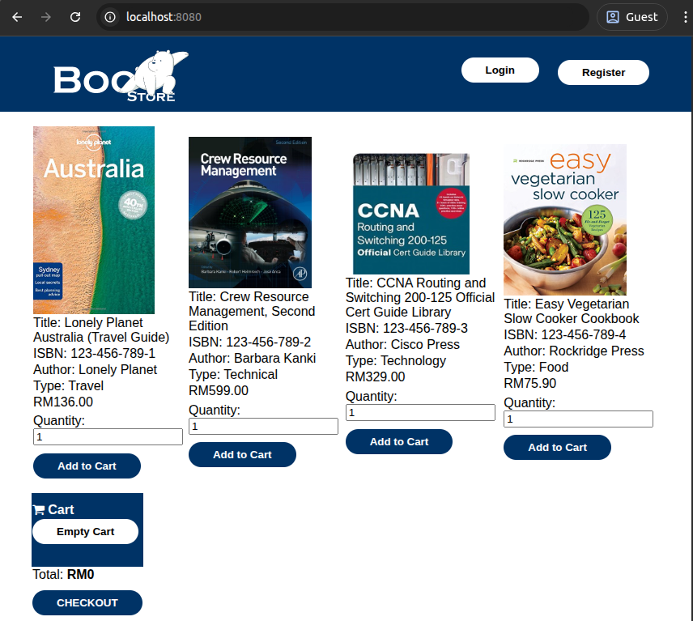
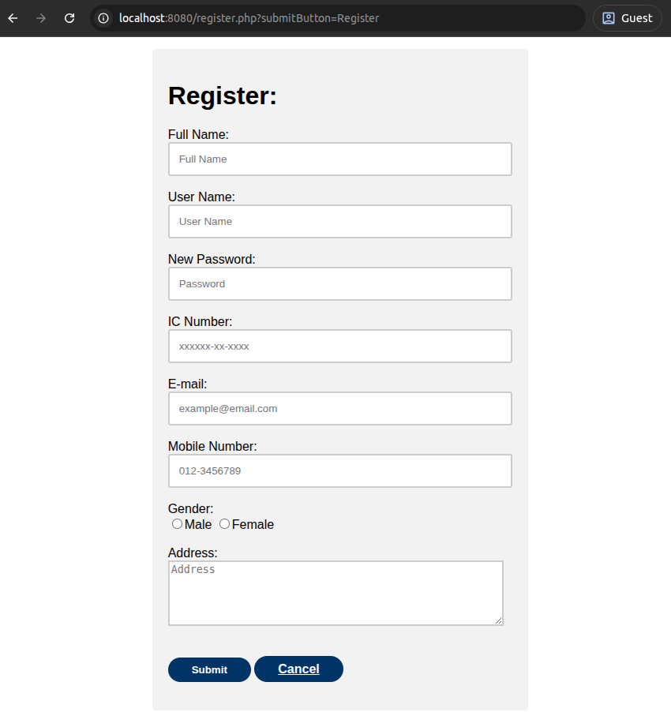
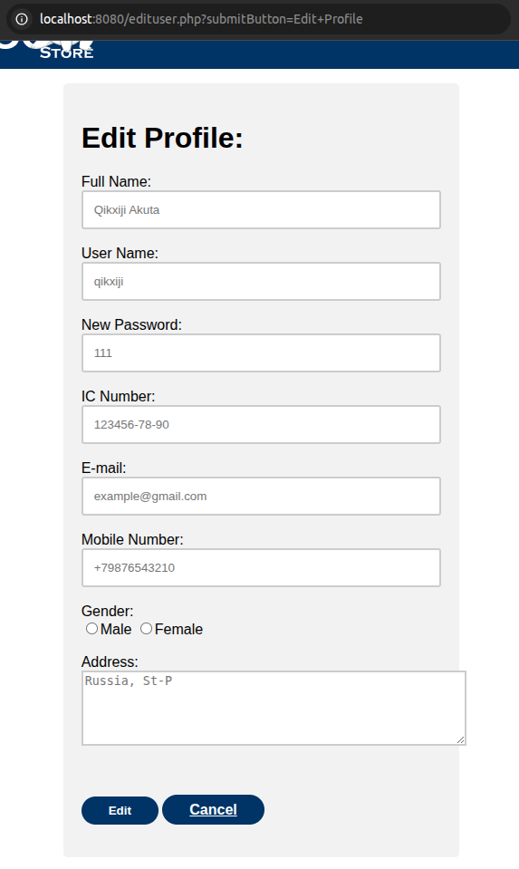

# Docker Compose NGINX/PHP-FPM/MySQL website deploy
> Реализовано развёртывание шаблонного сайта на PHP с базой данных MySQL.

### Стек приложения-шаблона:
- Nginx - веб/прокси-сервер. В проекте осуществляет отдачу статического контента и проксирование запросов пользователя к серверу  PHP-FPM.
- MySQL - БД, к которой подключается PHP-приложение для CRUD-операций с товарами и учётными даннными пользователей. 

### Продеданные работы:
В работу был принят шаблон сайта из открытого источника. Для исходного проекта было реализовано развёртывание в контейнеры Docker. Выполнены следующие задачи:
 - Составлен Dockerfile для создания образа NGINX с пакетами PHP-FPM для корректной работы скриптов php. В состав образа добавлены файлы расширенной конфигурации nginx (nginx.conf, php_site.conf).
 - Составлен Dockerfile для создания образа MySQL, включающего скрипты создания необходимой БД и пользователя при первом запуске контейнера.
 - Средствами Docker Compose создана сеть между контейнерами, создан именованный том (volume) для постоянного хранения данных БД, проброшены порты на хостовую машину, реализована передача пароля пользователя root с помощью docker secrets.

## Требования
- Установить Docker.

## Запуск приложения
- Перейдите в директорию с приложением и запустите `docker compose up -d`.
- Сборка образов, загрузка БД из дампа, поднятие сети между контейнерами и их запуск займет некоторое время.
- После успешного запуска перейдите в браузер и в поисковой строке браузера набрите `localhost:8080`
### Основное окно приложения

### Окно регистрации и окно редактирования данных пользователя
 

